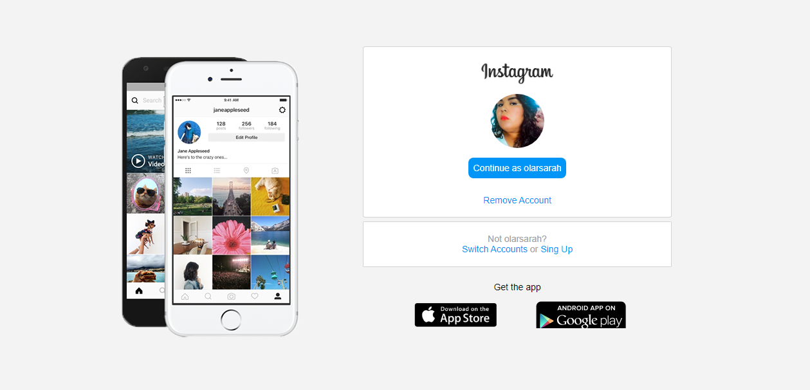

# Instagram Page
Este projeto foi desenvolvido como um **estudo** de caso sobre interface e responsividade.
O projeto trabalha com HTML e CSS e a intenção presente foi a de recriar a página inicial do Instagram.

## Resultado do Projeto 

